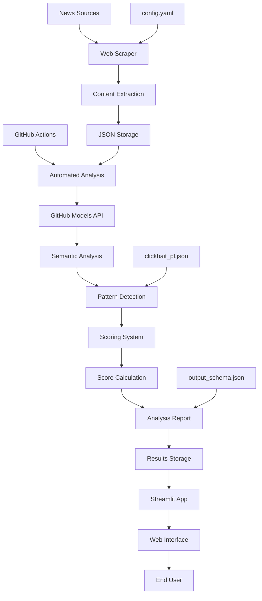

# Clickbait Verifier - Complete Documentation

## Table of Contents

1. [Overview](#overview)
2. [Architecture](#architecture)
3. [Installation & Setup](#installation--setup)
4. [Configuration](#configuration)
5. [Core Components](#core-components)
6. [Scoring Methodology](#scoring-methodology)
7. [API Reference](#api-reference)
8. [Web Interface](#web-interface)
9. [Automation & CI/CD](#automation--cicd)
10. [Development Guide](#development-guide)
11. [Troubleshooting](#troubleshooting)

---

## Overview

Clickbait Verifier is an automated system for analyzing and scoring articles based on their clickbait characteristics. The tool combines semantic analysis, pattern recognition, and machine learning techniques to identify manipulative content and provide transparency in media consumption.

### Core Features

- **Automated Article Scraping**: Configurable web scraping from multiple news sources
- **AI-Powered Analysis**: Semantic analysis using GitHub Models API
- **Clickbait Scoring**: Multi-dimensional scoring system with transparent methodology
- **Web Interface**: Streamlit-based dashboard for browsing and analyzing results
- **Automation**: GitHub Actions-powered continuous analysis pipeline
- **Extensible Architecture**: Modular design supporting multiple extractors and analyzers

### Technology Stack

- **Backend**: Python 3.10+, Streamlit, BeautifulSoup, Playwright
- **AI/ML**: GitHub Models API, Semantic Analysis, NLP
- **Storage**: JSON-based file system, YAML configuration
- **Frontend**: Streamlit Web App
- **Automation**: GitHub Actions, Cron scheduling
- **Development**: pytest, VS Code, GitBook documentation

---

## Architecture

### System Flow Diagram



### Core Components Architecture

The system is built on a modular architecture with clear separation of concerns:

**Data Layer**
- Configuration management (YAML)
- Lexicon storage (JSON)
- Results persistence (JSON files)
- Schema validation

**Processing Layer**
- Web scraping engines (requests, playwright)
- Content extractors (BeautifulSoup, readability)
- AI analysis pipeline (GitHub Models)
- Scoring algorithms

**Presentation Layer**
- Web interface (Streamlit)
- API endpoints
- Reporting tools

**Automation Layer**
- GitHub Actions workflows
- Scheduled tasks
- Continuous integration
- Deployment pipelines

---

## Installation & Setup

### Prerequisites

- Python 3.10 or higher
- pip package manager
- Git version control

### Developer Installation

1. **Clone the repository**
```bash
git clone https://github.com/mkonefal2/clickbait_verifier.git
cd clickbait_verifier
```

2. **Create virtual environment**
```powershell
python -m venv .venv
.\.venv\Scripts\Activate.ps1
```

3. **Install dependencies**
```powershell
pip install --upgrade pip
pip install -r requirements.txt
```

4. **Optional: Install Playwright for JavaScript rendering**
```powershell
pip install playwright
python -m playwright install chromium
```

5. **Configure environment variables**
```powershell
# Create .env file with API keys
echo "GITHUB_TOKEN=your_github_token" > .env
```

### Quick Demo Setup

For demonstration purposes without full scraping:

1. **Install Streamlit only**
```powershell
pip install streamlit
```

2. **Run demo feed**
```powershell
streamlit run clickbait_verifier/streamlit_feed_app.py
```

### Docker Installation (Optional)

```dockerfile
FROM python:3.10-slim

WORKDIR /app
COPY requirements.txt .
RUN pip install -r requirements.txt

COPY . .
EXPOSE 8501

CMD ["streamlit", "run", "clickbait_verifier/streamlit_feed_app.py"]
```

---

## Configuration

### Main Configuration File (config.yaml)

The system uses YAML configuration for managing news sources and scraping parameters:

```yaml
sources:
  - name: Example Source
    url: https://example.com/news
    enabled: true
    fetch_method: auto  # auto | requests | playwright
    scrape_listing: true
    only_today: false
    article_url_pattern: '/news/.*'

rate_limit_per_sec: 1
```

### Configuration Parameters

**Source Configuration**
- `name`: Human-readable source identifier
- `url`: Base URL or specific article URL
- `enabled`: Boolean flag to enable/disable source
- `fetch_method`: Scraping method (auto, requests, playwright)
- `scrape_listing`: Whether to scrape article listings
- `only_today`: Filter articles by publication date
- `article_url_pattern`: Regex pattern for article URL validation

**Global Settings**
- `rate_limit_per_sec`: Request rate limiting
- `timeout_seconds`: HTTP request timeout
- `user_agent`: Custom user agent string

### Environment Variables

```bash
# GitHub Models API
GITHUB_TOKEN=ghp_xxxxxxxxxxxx
GITHUB_MODEL=gpt-4

# Optional: Custom endpoints
API_BASE_URL=https://api.github.com
STREAMLIT_SERVER_PORT=8501
```

### Lexicon Files

**clickbait_pl.json**: Polish language clickbait patterns
```json
{
  "sensational_phrases": [
    "szokujące odkrycie",
    "niewiarygodne",
    "tajemnice ujawnione"
  ],
  "alarming_frames": [
    "to koniec",
    "dramat",
    "tragedia"
  ],
  "curiosity_gaps": [
    "nie uwierzycie",
    "zobacz co się stało"
  ]
}
```

---

## Core Components

### Web Scraper (clickbait_verifier/scraper.py)

The scraper component handles content extraction from various news sources:

**Features**
- Multi-method fetching (requests, playwright)
- Automatic method selection based on content type
- Rate limiting and error handling
- Content cleaning and normalization

**Usage**
```python
from clickbait_verifier.scraper import WebScraper

scraper = WebScraper()
content = scraper.scrape_url("https://example.com/article")
```

### Content Extractor (clickbait_verifier/content_extractor.py)

Extracts clean article content from HTML:

**Key Methods**
- `extract_title()`: Extract article title
- `extract_content()`: Extract main article text
- `extract_metadata()`: Extract publication date, author, etc.
- `clean_text()`: Remove ads, navigation, and boilerplate

### Analyzer (clickbait_verifier/analyzer.py)

Core analysis engine that processes articles:

**Analysis Pipeline**
1. Semantic feature extraction
2. Pattern matching against lexicons
3. Clickbait score calculation
4. Report generation

**Usage**
```python
from clickbait_verifier.analyzer import ClickbaitAnalyzer

analyzer = ClickbaitAnalyzer()
result = analyzer.analyze_article(title, content)
```

### Reporter (clickbait_verifier/reporter.py)

Generates structured analysis reports:

**Report Structure**
```json
{
  "article_id": "unique_identifier",
  "timestamp": "2025-10-30T12:00:00Z",
  "source": "source_name",
  "title": "Article Title",
  "clickbait_score": 75,
  "analysis": {
    "title_features": {...},
    "content_features": {...},
    "mismatch_analysis": {...}
  }
}
```

---

## Scoring Methodology

### Scoring Framework

The clickbait scoring system uses a multi-dimensional approach with weighted channels:

**Channel Weights**
- Title Analysis: 40%
- Content-Title Mismatch: 40%
- Content Features: 15%
- Monetization Indicators: 5%

### Positive Score Factors (Clickbait Indicators)

**Sensational Phrases (+12 points each, max 36)**
- Shock terms: "szokujące", "niewiarygodne", "niesłychane"
- Scandal indicators: "afera", "skandal", "dramat"
- Viral markers: "bomba", "hit", "game changer"

**Alarming Frames (+10 points each, max 20)**
- Crisis language: "to koniec", "dramat", "tragedia"
- Urgency markers: "pilne", "natychmiast", "ostatnia chwila"

**Curiosity Gaps (+8 points each, max 24)**
- Mystery hooks: "nie uwierzycie", "zobacz co się stało"
- Incomplete information: "powód was zaskoczy"

**Emotional Manipulation (+6 points each, max 18)**
- Strong emotions: "złość", "radość", "strach"
- Personal appeal: "dla ciebie", "musisz wiedzieć"

### Negative Score Factors (Quality Indicators)

**Credibility Markers (-5 points each)**
- Source citations: "według ekspertów", "badania pokazują"
- Specific data: dates, numbers, statistics
- Professional language: technical terms, formal tone

**Factual Content (-3 points each)**
- Neutral reporting language
- Balanced perspective presentation
- Clear attribution and sourcing

### Score Normalization

Final scores are normalized to 0-100 scale with classification:

- **0-25**: Reliable (Green)
- **26-50**: Moderately Clickbait (Yellow)
- **51-75**: Clickbait (Orange)
- **76-100**: Extreme Clickbait (Red)

---

## API Reference

### Core Classes

#### WebScraper

```python
class WebScraper:
    def __init__(self, config: dict = None)
    def scrape_url(self, url: str, method: str = "auto") -> dict
    def scrape_multiple(self, urls: list) -> list
    def set_rate_limit(self, requests_per_second: float)
```

#### ClickbaitAnalyzer

```python
class ClickbaitAnalyzer:
    def __init__(self, lexicon_path: str = None)
    def analyze_article(self, title: str, content: str) -> dict
    def calculate_score(self, features: dict) -> int
    def generate_explanation(self, analysis: dict) -> str
```

#### ContentExtractor

```python
class ContentExtractor:
    def extract_title(self, html: str) -> str
    def extract_content(self, html: str) -> str
    def extract_metadata(self, html: str) -> dict
    def clean_text(self, text: str) -> str
```

### Configuration Schema

```python
# Source configuration
{
    "name": str,
    "url": str,
    "enabled": bool,
    "fetch_method": str,  # "auto" | "requests" | "playwright"
    "scrape_listing": bool,
    "only_today": bool,
    "article_url_pattern": str
}

# Analysis result
{
    "article_id": str,
    "timestamp": str,
    "source": str,
    "url": str,
    "title": str,
    "content": str,
    "clickbait_score": int,
    "classification": str,
    "analysis": {
        "title_features": dict,
        "content_features": dict,
        "mismatch_score": int
    }
}
```

---

## Web Interface

### Streamlit Applications

The system provides multiple web interfaces:

#### Main Feed App (streamlit_feed_app.py)

Primary interface for browsing analyzed articles:

**Features**
- Article list with clickbait scores
- Filtering by source and score range
- Detailed analysis view
- Export functionality

**Navigation**
- Home: Article feed
- Analytics: Score distribution charts
- Sources: Source management
- Settings: Configuration options

#### Scraper App (streamlit_scraper_app.py)

Administrative interface for managing scraping:

**Features**
- Manual URL analysis
- Batch processing controls
- Scraping queue management
- Error logs and debugging

### Custom Components

The Streamlit apps use custom components for enhanced functionality:

```python
# Custom score display
def display_clickbait_score(score: int) -> None:
    color = get_score_color(score)
    st.metric("Clickbait Score", f"{score}/100", delta_color=color)

# Article card component
def render_article_card(article: dict) -> None:
    with st.container():
        st.subheader(article['title'])
        col1, col2 = st.columns([3, 1])
        with col1:
            st.write(article['summary'])
        with col2:
            display_clickbait_score(article['score'])
```

---

## Automation & CI/CD

### GitHub Actions Workflows

The project includes automated workflows for continuous operation:

#### Daily Analysis Workflow (.github/workflows/daily-analysis.yml)

**Trigger**: Daily at 19:00 UTC
**Purpose**: Automated article analysis and scoring

```yaml
name: Daily Clickbait Analysis
on:
  schedule:
    - cron: '0 19 * * *'
  workflow_dispatch:

jobs:
  analyze:
    runs-on: ubuntu-latest
    steps:
      - uses: actions/checkout@v4
      - name: Setup Python
        uses: actions/setup-python@v4
        with:
          python-version: '3.10'
      - name: Install dependencies
        run: pip install -r requirements.txt
      - name: Run analysis
        run: python scripts/analyze_batch_job.py
        env:
          GITHUB_TOKEN: ${{ secrets.GITHUB_TOKEN }}
      - name: Commit results
        run: |
          git config user.name "Clickbait Bot"
          git add reports/analysis/
          git commit -m "Automated daily analysis: $(date)"
          git push
```

#### Scraping Workflow (.github/workflows/daily-scrape-and-analyze.yml)

**Trigger**: Daily at 14:00 UTC
**Purpose**: Content scraping from configured sources

### Local Automation Scripts

**analyze_batch_job.py**: Batch analysis of unanalyzed articles
```python
python scripts/analyze_batch_job.py --limit 50 --source rmf24
```

**run_scraper.py**: Manual scraping execution
```python
python scripts/run_scraper.py --config config.yaml --output reports/scraped/
```

### Deployment

**Streamlit Cloud Deployment**
1. Connect GitHub repository to Streamlit Cloud
2. Select `clickbait_verifier/streamlit_feed_app.py` as main file
3. Configure environment variables in Streamlit dashboard
4. Deploy automatically on git push

**Heroku Deployment**
```bash
# Create Procfile
echo "web: streamlit run clickbait_verifier/streamlit_feed_app.py --server.port \$PORT" > Procfile

# Deploy
heroku create your-app-name
git push heroku main
```

---

## Development Guide

### Project Structure

```
clickbait_verifier/
├── clickbait_verifier/          # Main package
│   ├── core/                    # Core abstractions
│   ├── extractors/              # Source-specific extractors
│   ├── pages/                   # Streamlit pages
│   ├── ui/                      # UI components
│   └── utils/                   # Utility functions
├── scripts/                     # Automation scripts
├── docs/                        # Documentation
├── reports/                     # Analysis outputs
│   ├── scraped/                 # Raw scraped data
│   └── analysis/                # Analysis results
├── schemas/                     # JSON schemas
├── lexicons/                    # Language patterns
└── tests/                       # Unit tests
```

### Development Workflow

1. **Feature Development**
```bash
git checkout -b feature/new-analyzer
# Implement changes
git add .
git commit -m "Add new semantic analyzer"
git push origin feature/new-analyzer
# Create pull request
```

2. **Testing**
```bash
# Run unit tests
python -m pytest tests/

# Run specific test
python -m pytest tests/test_analyzer.py::test_clickbait_detection

# Run with coverage
python -m pytest --cov=clickbait_verifier tests/
```

3. **Code Quality**
```bash
# Format code
black clickbait_verifier/
isort clickbait_verifier/

# Lint code
flake8 clickbait_verifier/
pylint clickbait_verifier/
```

### Adding New Features

**New Content Extractor**
1. Create extractor class in `clickbait_verifier/extractors/`
2. Inherit from `BaseExtractor`
3. Implement required methods
4. Add configuration to `config.yaml`
5. Register in extractor factory

**New Analysis Method**
1. Add analysis function to `analyzer.py`
2. Update scoring methodology
3. Add lexicon patterns if needed
4. Update schema definitions
5. Add unit tests

**New UI Component**
1. Create component in `clickbait_verifier/ui/`
2. Add to appropriate Streamlit page
3. Update navigation if needed
4. Test responsive design
5. Document usage

### Best Practices

**Code Style**
- Follow PEP 8 conventions
- Use type hints for function signatures
- Write descriptive docstrings
- Keep functions focused and small

**Error Handling**
- Use specific exception types
- Log errors with appropriate levels
- Provide user-friendly error messages
- Implement graceful degradation

**Performance**
- Cache expensive operations
- Use async/await for I/O operations
- Optimize database queries
- Monitor memory usage

**Security**
- Validate all user inputs
- Sanitize HTML content
- Use environment variables for secrets
- Implement rate limiting

---

## Troubleshooting

### Common Issues

**Installation Problems**

*Issue*: `pip install` fails with dependency conflicts
*Solution*:
```bash
pip install --upgrade pip
pip install --force-reinstall -r requirements.txt
```

*Issue*: Playwright installation fails
*Solution*:
```bash
python -m playwright install --with-deps chromium
```

**Scraping Issues**

*Issue*: HTTP 403 Forbidden errors
*Solution*: Configure custom user agent in `config.yaml`
```yaml
user_agent: "Mozilla/5.0 (Windows NT 10.0; Win64; x64) AppleWebKit/537.36"
```

*Issue*: JavaScript-heavy sites not loading
*Solution*: Use playwright fetch method
```yaml
fetch_method: playwright
```

**Analysis Problems**

*Issue*: GitHub Models API rate limiting
*Solution*: Implement exponential backoff
```python
import time
import random

def retry_with_backoff(func, max_retries=3):
    for attempt in range(max_retries):
        try:
            return func()
        except RateLimitError:
            wait_time = (2 ** attempt) + random.uniform(0, 1)
            time.sleep(wait_time)
```

*Issue*: Memory usage too high during batch processing
*Solution*: Process articles in smaller chunks
```python
def process_in_chunks(articles, chunk_size=10):
    for i in range(0, len(articles), chunk_size):
        chunk = articles[i:i+chunk_size]
        process_chunk(chunk)
        gc.collect()  # Force garbage collection
```

**Streamlit Issues**

*Issue*: App crashes with "RerunException"
*Solution*: Use session state properly
```python
if 'initialized' not in st.session_state:
    st.session_state.initialized = True
    st.session_state.data = load_data()
```

*Issue*: Slow loading with large datasets
*Solution*: Implement pagination and caching
```python
@st.cache_data
def load_articles(page=1, per_page=20):
    return get_articles_page(page, per_page)
```

### Debug Mode

Enable debug logging for troubleshooting:

```python
import logging

logging.basicConfig(
    level=logging.DEBUG,
    format='%(asctime)s - %(name)s - %(levelname)s - %(message)s'
)

logger = logging.getLogger(__name__)
logger.debug("Debug information here")
```

### Performance Monitoring

Monitor system performance:

```python
import time
import psutil

def monitor_performance(func):
    def wrapper(*args, **kwargs):
        start_time = time.time()
        start_memory = psutil.Process().memory_info().rss
        
        result = func(*args, **kwargs)
        
        end_time = time.time()
        end_memory = psutil.Process().memory_info().rss
        
        print(f"Execution time: {end_time - start_time:.2f}s")
        print(f"Memory usage: {(end_memory - start_memory) / 1024 / 1024:.2f}MB")
        
        return result
    return wrapper
```

### Support and Contributing

**Getting Help**
- Check existing GitHub issues
- Review documentation thoroughly
- Test with minimal examples
- Provide complete error messages

**Contributing**
- Fork the repository
- Create feature branch
- Follow coding standards
- Add tests for new features
- Update documentation
- Submit pull request

**Issue Reporting**
Include the following information:
- Operating system and version
- Python version
- Complete error traceback
- Steps to reproduce
- Expected vs actual behavior
- Configuration files (sanitized)

---

## Conclusion

Clickbait Verifier provides a comprehensive solution for automated content analysis and clickbait detection. The modular architecture, extensive configuration options, and multiple interfaces make it suitable for both research and production use cases.

The system's strength lies in its transparency - every score is explainable through the detailed methodology, and the open-source nature allows for continuous improvement and customization.

For the latest updates and community contributions, visit the [GitHub repository](https://github.com/mkonefal2/clickbait_verifier).