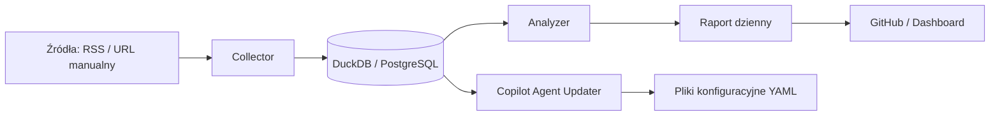

# Clickbait Verifier — Full System Specification

## Cel projektu
Clickbait Verifier to system, który automatycznie pobiera wiadomości z portali informacyjnych, przechowuje je w lokalnej bazie danych, analizuje pod kątem clickbaitu oraz generuje codzienne raporty tekstowe i CSV. Dodatkowo GitHub Copilot Agent automatycznie utrzymuje i aktualizuje konfiguracje ekstraktorów HTML dla każdego portalu.

---

## Główne komponenty systemu

| Warstwa | Opis | Lokalizacja |
|----------|------|--------------|
| **Collector / Scraper** | Pobiera artykuły z RSS lub zdefiniowanych URL-i i zapisuje dane w bazie | `clickbait_verifier/scraper.py` |
| **Content Extractors** | Moduły i konfiguracje CSS/XPath dla poszczególnych portali | `clickbait_verifier/extractors/` |
| **Analyzer** | Oblicza wskaźnik clickbaitowości na podstawie heurystyk i podobieństwa semantycznego | `clickbait_verifier/analyzer.py` |
| **Database Layer** | Przechowuje artykuły i wyniki analizy w DuckDB lub PostgreSQL | `data/db.duckdb` |
| **Reporter** | Generuje raporty dzienne (Markdown i CSV) | `clickbait_verifier/reporter.py` |
| **Copilot Agent Updater** | Analizuje logi scraperów i automatycznie aktualizuje konfiguracje ekstraktorów | `scripts/update_extractors_with_agent.py` |
| **Scheduler / Automation** | Harmonogram zadań lokalnych (Task Scheduler, cron) lub GitHub Actions | `.github/workflows/*.yml` |

---

## Architektura logiczna



---

## Struktura repozytorium
```
clickbait-verifier/
├─ clickbait_verifier/
│  ├─ main.py
│  ├─ scraper.py
│  ├─ analyzer.py
│  ├─ reporter.py
│  ├─ utils.py
│  ├─ content_extractor.py
│  ├─ core/
│  │   ├─ fetcher.py
│  │   ├─ parser.py
│  │   ├─ extractor_base.py
│  │   └─ storage.py
│  └─ extractors/
│      ├─ rmf24.yaml
│      ├─ rmf24.py
│      ├─ onet.yaml
│      └─ ...
├─ data/
│  └─ db.duckdb
├─ logs/
│  └─ extract_failures.jsonl
├─ scripts/
│  └─ update_extractors_with_agent.py
├─ reports/
├─ requirements.txt
├─ config.yaml
├─ run.ps1
└─ .github/workflows/
   ├─ daily.yml
   └─ agent_update.yml
```

---

## Przepływ danych

1. **Collector / Scraper**
   - Wczytuje listę źródeł z `config.yaml` lub URL podany ręcznie.
   - Pobiera RSS lub pełny HTML.
   - Wybiera odpowiedni ekstraktor (`extractors/<portal>.yaml`).
   - Zapisuje dane (title, url, body, published) do bazy.

2. **Analyzer**
   - Oblicza wskaźnik clickbaitu (0–100) na podstawie:
     - heurystyk językowych,
     - długości i formy tytułu,
     - nadmiaru interpunkcji,
     - podobieństwa semantycznego tytułu i treści.
   - Wynik zapisuje do bazy (`score`, `label`, `reasons`).

3. **Reporter**
   - Codziennie generuje raport Markdown + CSV (`reports/report_YYYY-MM-DD.md`).
   - Raport zawiera kolumny: źródło, tytuł, score, poziom clickbaitu, link, powody.

4. **Copilot Agent Updater**
   - Analizuje logi z `logs/extract_failures.jsonl`.
   - Wysyła do modelu prompt z fragmentem HTML.
   - Otrzymuje YAML z nowymi selektorami CSS.
   - Aktualizuje odpowiedni plik YAML.
   - Testuje poprawkę i commit-uje ją automatycznie.

---

## Skala clickbaitu
| Zakres | Etykieta | Interpretacja |
|---------|-----------|----------------|
| 0–20 | Brak | Tytuł informacyjny, spójny z treścią |
| 21–40 | Niski | Drobne wyolbrzymienia |
| 41–60 | Średni | Typowe clickbaitowe chwyty |
| 61–80 | Wysoki | Silny clickbait, niska zgodność |
| 81–100 | Całkowita niezgodność | Tytuł mylący lub nieprawdziwy |

---

## Baza danych (DuckDB / PostgreSQL)
### Tabela `articles`
```sql
CREATE TABLE articles (
  id BIGINT PRIMARY KEY,
  source TEXT,
  title TEXT,
  url TEXT,
  published TIMESTAMP,
  fetched_at TIMESTAMP,
  content TEXT,
  score DOUBLE,
  label TEXT,
  reasons TEXT,
  similarity DOUBLE,
  analyzed_at TIMESTAMP
);
```

### Tabela `sources`
```sql
CREATE TABLE sources (
  name TEXT PRIMARY KEY,
  rss TEXT NOT NULL,
  enabled BOOLEAN DEFAULT TRUE
);
```

---

## Harmonogram / Automatyzacja
### Lokalnie (Windows / Linux)
- `run.ps1` — uruchamia scraper + raport.
- Task Scheduler lub `cron` → 1× dziennie.

### GitHub Actions
- `daily.yml` — codzienny scraping + raport.
- `agent_update.yml` — automatyczna aktualizacja konfiguracji ekstraktorów.

---

## Przepływ pracy Copilot Agent
1. Scraper zapisuje błędy ekstrakcji (np. brak selektora).
2. Agent uruchamiany przez GitHub Actions analizuje logi.
3. Copilot generuje poprawione selektory w YAML.
4. Agent aktualizuje plik i wykonuje commit.
5. Przy kolejnym uruchomieniu scraper działa już poprawnie.

---

## Bezpieczeństwo i etyka
- Scraping tylko z legalnych źródeł (RSS, publiczne strony bez paywalla).
- Respektowanie robots.txt.
- Brak pobierania danych prywatnych lub zastrzeżonych.
- Ograniczenie liczby żądań (rate-limit w `config.yaml`).

---

## Przyszłe rozszerzenia
- Dashboard (Streamlit / Superset) do wizualizacji historii clickbaitów.
- Integracja z modelami LLM do automatycznej klasyfikacji semantycznej.
- Analiza trendów clickbaitowych w czasie (źródła / tematy / język).
- Zbieranie statystyk skuteczności ekstraktorów i ich automatyczne testy.

