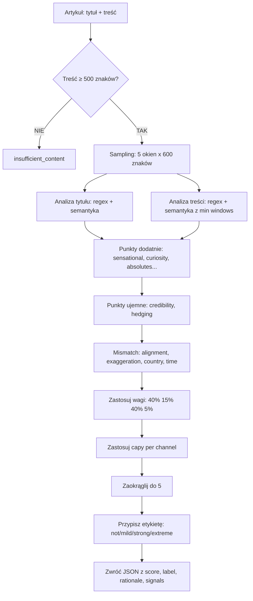

# Metodologia punktacji clickbaitu

## Spis treści
1. [Podstawy systemu](#podstawy-systemu)
2. [Punkty dodatnie - cechy clickbaitowe](#punkty-dodatnie---cechy-clickbaitowe)
3. [Punkty ujemne - cechy wiarygodne](#punkty-ujemne---cechy-wiarygodne)
4. [Trafienia semantyczne](#trafienia-semantyczne)
5. [Końcowe przeliczenie](#końcowe-przeliczenie)
6. [Etykiety i interpretacja](#etykiety-i-interpretacja)
7. [Przykład kalkulacji](#przykład-kalkulacji)
8. [Kluczowe zasady](#kluczowe-zasady)

---

## Podstawy systemu

System działa na zasadzie **dodawania i odejmowania punktów** za różne cechy wykryte w tytule i treści artykułu. Końcowy wynik (score) jest **normalizowany do skali 0-100** i przypisywany do kategorii.

### Wagi kanałów
- **Tytuł**: 40% (najważniejszy - pierwsze wrażenie czytelnika)
- **Rozbieżności (mismatch)**: 40% (czy treść potwierdza obietnice z tytułu)
- **Treść**: 15% (cechy sensacyjne w tekście)
- **Monetyzacja**: 5% (affiliate links, kupony)

---

## Punkty dodatnie - cechy clickbaitowe

### 1. TYTUŁ (title_features) - waga: 40%

#### 🔥 **Sensational phrases** (frazy sensacyjne) - NAJWYŻEJ PUNKTOWANE
**+12 pkt za każde trafienie** (cap: 36 pkt max)

Wykrywane słowa:
- **Kuriozalne sytuacje**: `kuriozalne`, `absurdalne`, `wywraca naukę do góry nogami`
- **Zmiana historii**: `odmieniła`, `zmienia całą historię`
- **Szok i sensacja**: `szok`, `wstrząs`, `porażający`, `niewiarygodne`, `niebywałe`, `niesłychane`, `niesamowite`, `zaskakujące`
- **Skandale**: `afera`, `skandal`, `dramat`, `horror`, `tragedia`, `masakra`
- **Virale**: `bomba`, `hit`, `viral`, `game changer`
- **Apokalipsa**: `to koniec`, `koniec świata`
- **Tajemnice**: `ujawnione`, `zdemaskowane`, `tajemnice`, `sekrety`, `wyciek`

**Przykład**: "Szokujące odkrycie! Naukowcy ujawnili tajemnicę" → +12 (szokujące) +12 (ujawnili) +12 (tajemnicę) = **+36 pkt**

---

#### ⚠️ **Alarming frames** (alarmujące ramy)
**+10 pkt za każde trafienie** (cap: 20 pkt max)

Wykrywane słowa:
- **Katastrofy**: `wybuchy`, `eskalacja`, `katastrofa`, `kataklizm`, `armagedon`, `apokalipsa`
- **Kryzysy**: `kryzys`, `chaos`, `załamanie`, `krach`, `bessa`, `zapaść`, `blackout`
- **Awarie**: `awaria`, `paraliż`
- **Zagrożenia**: `na skraju`, `na krawędzi`, `tuż przed`, `grozi`, `zagrożenie`, `ostrzeżenie`, `alert`, `alert RCB`
- **Stany wyjątkowe**: `stan wyjątkowy`, `stan klęski`, `ewakuacja`, `lockdown`, `epidemia`, `pandemia`

**Przykład**: "Kryzys na krawędzi! Alert RCB dla całego kraju" → +10 (kryzys) +10 (na krawędzi) = **+20 pkt (cap)**

---

#### 🚫 **Absolutes** (absolutne stwierdzenia)
**+8 pkt za każde trafienie** (cap: 24 pkt max)

Wykrywane słowa:
- `zawsze`, `nigdy`, `wszyscy`, `wszystko`, `każdy`
- `na pewno`, `z pewnością`, `bez wątpienia`, `bezsprzecznie`
- `bez dwóch zdań`, `koniec kropka`, `koniec dyskusji`
- `sto procent`, `100%`, `gwarantowane`

**Przykład**: "Każdy to robi źle! Nigdy więcej popełnisz tego błędu" → +8 (każdy) +8 (nigdy) = **+16 pkt**

---

#### 🔍 **Curiosity gap** (luka ciekawości)
**+6 pkt za każde trafienie** (cap: 18 pkt max)

Wykrywane frazy:
- **Triki**: `ten (jeden) trik`, `sztuczka`, `lifehack`, `hack`
- **CTA**: `sprawdź (jak/co)`, `zobacz (jak/co się stało)`
- **Niedowierzanie**: `nie uwierzysz`, `nie zgadniesz`
- **Obietnice**: `oto dlaczego`, `oto jak`, `oto co się stanie`
- **Sekrety**: `poznaj prawdę`, `poznaj sekret`, `to musisz zobaczyć`

**Przykład**: "Nie uwierzysz! Sprawdź ten trik, który odmieni twoje życie" → +6 (nie uwierzysz) +6 (sprawdź) +6 (ten trik) = **+18 pkt (cap)**

---

#### 📋 **Listicle** (listy numeryczne)
**+6 pkt za każde trafienie** (cap: 12 pkt max)

Wykrywane frazy:
- `top`, `ranking`, `lista`
- `X powodów`, `X rzeczy`, `X faktów`, `X sekretów`
- `X sposobów`, `X błędów`, `X porad`, `X kroków`
- `X przepisów`, `X przykładów`, `X funkcji`, `X zmian`
- `X mitów`, `X trików`

**Przykład**: "Top 10 sekretów! 5 sposobów na sukces" → +6 (top) +6 (sekretów) = **+12 pkt (cap)**

---

#### ⚽ **Sports rumor** (plotki sportowe)
**+10 pkt za każde trafienie** (cap: 20 pkt max)

Wykrywane słowa:
- **Oficjalne**: `oficjalnie`, `potwierdzone`
- **Transfery**: `transfer`, `hit transferowy`, `bomba transferowa`, `dopięte`, `dogadane`, `podpisane`, `kontrakt`
- **Odejścia**: `odchodzi`, `rozstaje się`, `wylatuje`, `zwolniony`, `dymisja`, `ultimatum`
- **Plotki**: `sensacja okienka`, `plotki`, `kulisy`, `zakulisowe`

**Przykład**: "Bomba transferowa! Lewandowski dogadany, oficjalnie odchodzi" → +10 (bomba) +10 (oficjalnie) = **+20 pkt (cap)**

---

#### 🎯 **Superlatives** (przesada, superlatywy)
**+6 pkt za każde trafienie** (cap: 18 pkt max)

Wykrywane słowa:
- `najlepszy`, `największy`, `najgorszy`, `najszybszy`, `najmocniejszy`, etc.

**Przykład**: "Najlepszy sposób! Największa rewolucja w historii" → +6 (najlepszy) +6 (największa) = **+12 pkt**

---

#### ❗ **Interpunkcja** (punctuation signals)

| Element | Punkty | Cap | Przykład |
|---------|--------|-----|----------|
| **Wykrzykniki** | +3 za każdy | 9 pkt | "Szok! Rewelacja! Nie uwierzysz!" → +9 pkt |
| **Pytajnik na końcu** | +4 | - | "Czy to koniec Polski?" → +4 pkt |
| **Wielokropek** | +2 za każdy | 6 pkt | "Oto co się stało... Nikt tego nie widział..." → +4 pkt |
| **CAPSLOCK (wysoki ratio)** | +6 | - | "NIE UWIERZYSZ CO SIĘ STAŁO" → +6 pkt |
| **Emoji** | +4 | - | "Szok 😱 Nie uwierzysz 🔥" → +4 pkt |

---

**⚠️ CAP dla całego kanału TYTUŁ: 60 pkt**

---

### 2. TREŚĆ (content_features) - waga: 15%

#### 🔥 **Sensational phrases** (frazy sensacyjne w treści)
**+8 pkt za każde trafienie** (cap: 24 pkt max)

- **To SAMO regex co w tytule** (wszystkie frazy sensacyjne + alarming)
- ⚠️ **WYMÓG**: Musi wystąpić w **minimum 2 różnych oknach** (z 5 okien próbkowania treści)
- Okna: start (0%), 25%, 50%, 75%, koniec (100%) - każde po 600 znaków z overlap 50 znaków

**Przykład**: Jeśli "szokujące" występuje tylko na początku → **0 pkt**. Jeśli występuje na początku i w środku → **+8 pkt**.

---

#### 💯 **Overcertainty** (nadmierna pewność)
**+6 pkt za każde trafienie** (cap: 18 pkt max)

Wykrywane frazy:
- `na pewno`, `bezsprzecznie`, `niezbicie dowodzi`, `koniec dyskusji`

⚠️ **WAŻNA ZASADA**: Jeśli w tekście wykryto **hedging** (`może`, `prawdopodobnie`), overcertainty **NIE jest liczone** (mutual exclusion - hedging wygrywa).

**Przykład**: 
- Tekst: "Na pewno to działa. Bezsprzecznie udowodnione." → +6 (na pewno) +6 (bezsprzecznie) = **+12 pkt**
- Tekst: "Na pewno to działa. Może to zadziała." → hedging wygrywa → overcertainty **0 pkt**, hedging **-2 pkt**

---

**⚠️ CAP dla całego kanału TREŚĆ: 35 pkt**

---

### 3. MONETYZACJA (monetization) - waga: 5%

#### 💰 **Affiliate links**
**+4 pkt za każde trafienie** (cap: 12 pkt max)

Wykrywane frazy:
- `affiliate`, `partner link`, `kup teraz`, `tylko dziś`

---

#### 🎟️ **Kupony/CTA**
**+3 pkt za każde trafienie** (cap: 9 pkt max)

Wykrywane frazy:
- `rabat`, `kupon`, `promocja`

**Przykład**: "Kup teraz z rabatem! Partner link z kuponem tylko dziś!" → +4 (kup teraz) +4 (partner link) +3 (rabat) +3 (kupon) = **+12 pkt (cap affiliate) + 6 pkt (kupony) = 18 pkt total, ale cap monetization = 10**

---

**⚠️ CAP dla całego kanału MONETIZATION: 10 pkt**

---

### 4. ROZBIEŻNOŚCI (mismatch) - waga: 40% ⚠️ NAJWAŻNIEJSZY KANAŁ

#### 🎯 **Low alignment** (niska zgodność tytuł-treść)
**+18 pkt penalty** jeśli alignment_score < 0.45

**Alignment score** = stosunek obietnic z tytułu potwierdzonych w treści

**Przykład**:
- Tytuł: "Naukowcy odkryli 5 sekretów długowieczności"
- Treść wspomina tylko 2 sekrety → alignment = 2/5 = 0.40 < 0.45 → **+18 pkt penalty**

---

#### ⚖️ **Medium alignment** (średnia zgodność)
**+8 pkt penalty** jeśli alignment_score < 0.65

**Przykład**:
- Tytuł: "10 sposobów na zdrowie"
- Treść wspomina 6 sposobów → alignment = 6/10 = 0.60 < 0.65 → **+8 pkt penalty**

---

#### 📏 **Exaggeration gap** (luka przesady)
**+14 pkt penalty**

**Warunki**:
1. Tytuł zawiera `sensational` LUB `alarming` frazy
2. **ORAZ** treść zawiera redukcje wiarygodności:
   - Credibility signals (nazwy org., cytaty, liczby)
   - Hedging (`może`, `prawdopodobnie`)

**Logika**: Sensacyjny tytuł + ostrożna/wiarygodna treść = manipulacja emocjami w tytule

**Przykład**:
- Tytuł: "SZOK! Rewolucyjne odkrycie naukowców!"
- Treść: "Naukowcy z Uniwersytetu Warszawskiego sugerują, że może to wskazywać..."
- → Sensational w tytule (szok, rewolucyjne) + credibility (UW) + hedging (może, sugerują) → **+14 pkt**

---

#### 💰 **Paywall / za krótka treść**
**+22 pkt penalty**

**Warunek**: Treść < 500 znaków

**Logika**: Niemożliwa weryfikacja obietnic z tytułu = clickbait

---

#### 🌍 **Country mismatch** (rozbieżność geograficzna)
**+18 pkt penalty**

**Warunki**:
1. **Tytuł** wspomina kraj (np. "w Polsce", "u nas") LUB
2. Jeśli tytuł NIE wspomina kraju: system **domyślnie zakłada "Polska"** (`assume_title_local_if_missing: true`)
3. **Treść** wyraźnie odnosi się do **innego kraju** (np. "we Francji", "w Niemczech")

**Przykłady**:

✅ **MISMATCH (penalty +18 pkt)**:
- Tytuł: "Szokujące odkrycie naukowców" (domyślnie = Polska)
- Treść: "Badanie przeprowadzono we Francji..."

✅ **MISMATCH (penalty +18 pkt)**:
- Tytuł: "Dramat w Polsce! Ludzie w szoku"
- Treść: "Jak donoszą media niemieckie, w Berlinie..."

❌ **BRAK MISMATCH**:
- Tytuł: "Odkrycie naukowców w Polsce"
- Treść: "Polski zespół z Uniwersytetu Warszawskiego..."

❌ **BRAK MISMATCH**:
- Tytuł: "Rewolucja we Francji"
- Treść: "Francuscy naukowcy odkryli..."

---

#### ⏰ **Time omission** (brak ram czasowych w tytule)
**+12 pkt penalty**

**Warunki** (wszystkie muszą być spełnione):
1. Treść zawiera **wykryte ramy czasowe** (np. "w zeszłym roku", "przed miesiącem", "od 2020 roku")
2. Tytuł **nie zawiera** ram czasowych
3. **DODATKOWO**: Tytuł jest **sensacyjny LUB alarmujący** (`apply_only_if_title_sensational_or_alarming: true`)

**Logika**: Ukrywanie kontekstu czasowego w sensacyjnych tytułach = manipulacja (stara wiadomość jako nowa sensacja)

**Przykłady**:

✅ **PENALTY +12 pkt**:
- Tytuł: "SZOK! Naukowcy odkryli nowy gatunek" (sensacyjny + brak ram czasowych)
- Treść: "W 2015 roku zespół odkrył..."

❌ **BRAK PENALTY**:
- Tytuł: "Naukowcy odkryli nowy gatunek" (neutralny + brak ram czasowych)
- Treść: "W 2015 roku zespół odkrył..."
- Powód: Tytuł nie jest sensacyjny/alarmujący

❌ **BRAK PENALTY**:
- Tytuł: "SZOK! W 2015 roku naukowcy odkryli nowy gatunek" (zawiera ramę czasową)
- Treść: "W 2015 roku zespół odkrył..."

---

#### 📅 **Date omission** (brak konkretnych dat w tytule)
**+8 pkt penalty**

Analogicznie do time_omission, ale dla **konkretnych dat** (np. "15 marca 2023").

---

**⚠️ CAP dla całego kanału MISMATCH: 30 pkt**

---

## Punkty ujemne - cechy wiarygodne

### 🎓 **Credibility signals** (sygnały wiarygodności)

#### **Org names** (nazwy organizacji)
**-3 pkt za każde trafienie** (cap: -12 pkt max)

Wykrywane nazwy:
- **Czasopisma naukowe**: `nature`, `science`, `cell`, `pnas`, `arxiv`, `doi`, `journal`
- **Instytucje**: `esrf`, `diamond light source`, `IMGW`, `GUS`, `Biały Dom`
- **Uczelnie**: `uniwersytet`, `UW`, `AGH`, `instytut`
- **Media**: `rmf24`

**Przykład**: "Według badania opublikowanego w Nature przez Uniwersytet Warszawski..." → -3 (nature) -3 (uniwersytet) = **-6 pkt**

---

#### **Numbers/dates/units** (liczby, daty, jednostki)
**-2 pkt za każde trafienie** (cap: -10 pkt max)

Wykrywane: konkretne liczby, daty, jednostki miary (np. "1500 osób", "15 marca 2023", "25 km/h")

**Przykład**: "Badanie objęło 1500 osób w okresie 2020-2023 na obszarze 250 km²" → -2 -2 -2 = **-6 pkt**

---

#### **Quoted speakers** (cytowani eksperci)
**-2 pkt za każde trafienie** (cap: -8 pkt max)

Wykrywane: cytaty ekspertów w cudzysłowie z podaniem nazwiska/funkcji

**Przykład**: "Jak powiedział prof. Kowalski: 'To przełomowe odkrycie'" → **-2 pkt**

---

#### **Methods terms** (terminologia naukowa)
**-2 pkt za każde trafienie** (cap: -8 pkt max)

Wykrywane słowa:
- `skan`, `skanowanie`, `synchrotron`, `rentgen`
- `analiza morfologiczna`, `metoda`, `badanie`
- `metaanaliza`, `ankieta reprezentatywna`

**Przykład**: "Zespół użył skanowania synchrotronowego i analizy morfologicznej..." → -2 (skan) -2 (analiza) = **-4 pkt**

---

### 🤔 **Hedging** (ostrożne sformułowania)

#### **Hedging terms**
**-2 pkt za każde trafienie** (cap: -10 pkt max)

Wykrywane słowa:
- `może`, `prawdopodobnie`, `sugeruje`, `wskazuje`, `wydaje się`, `możliwe`

⚠️ **KLUCZOWA ZASADA - MUTUAL EXCLUSION**:
Gdy hedging i overcertainty kolidują → **HEDGING ZAWSZE WYGRYWA**

**Przykład**:
- Tekst: "Może to działa. Prawdopodobnie skuteczne. Wydaje się obiecujące."
- → -2 (może) -2 (prawdopodobnie) -2 (wydaje się) = **-6 pkt**

---

## Trafienia semantyczne

System preferuje **regex** jako źródło prawdy, ale dopuszcza **trafienia semantyczne** od LLM (model językowy):

### Zasady hybrydowe (PREFER_REGEX_WITH_SEMANTIC):

1. **Regex ma priorytet** - jeśli regex złapał daną frazę, semantyka nie dodaje punktów
2. **Confidence threshold**: 0.85 - minimalna pewność LLM aby zgłosić trafienie
3. **Weight multiplier**: 0.5 - trafienia semantyczne liczą się z wagą **50%**
4. **Oznaczenie**: Każde trafienie musi być oznaczone jako `"semantic:<opis>"`

### Przykład trafienia semantycznego:

**Tytuł**: "To odmieni twoje życie na zawsze"

**Analiza**:
- Regex nie wykrywa dokładnie "odmieni twoje życie" (brak w liscie)
- LLM rozpoznaje semantycznie jako **sensational phrase** z confidence 0.92

```json
"title_semantic_hits": [
  {
    "text": "odmieni twoje życie na zawsze",
    "confidence": 0.92,
    "category": "sensational"
  }
]
```

**Punktacja**: +12 pkt (sensational) × 0.5 (multiplier) = **+6 pkt**

---

## Końcowe przeliczenie

### Formuła:

```
raw_score = (title_points × 0.40) + 
            (content_points × 0.15) + 
            (mismatch_penalties × 0.40) + 
            (monetization_points × 0.05) +
            credibility_reductions +
            hedging_reductions
```

### Capy (limity):

```yaml
per_channel:
  title: 60 pkt
  content: 35 pkt
  mismatch: 30 pkt
  monetization: 10 pkt

overall: 100 pkt  # maksymalny możliwy score
```

### Zaokrąglenie:

Wynik jest zaokrąglany do **najbliższej 5**:
- 67 → 65
- 73 → 75
- 48 → 50
- 52 → 50

### Penalty relaxation (łagodzenie kar):

Dla zaufanych źródeł można zmniejszyć kary:

```yaml
rmf24.pl:
  base_reputation: "medium"
  penalty_relaxation: 1

focus.pl:
  base_reputation: "medium"
  penalty_relaxation: 2

.gov.pl:
  base_reputation: "high"
  penalty_relaxation: 4
```

Penalty relaxation odejmuje się od kar mismatch przed zastosowaniem cap.

---

## Etykiety i interpretacja

### Progi etykiet:

| Score | Etykieta | Znaczenie | Akcja |
|-------|----------|-----------|-------|
| **0-24** | `not_clickbait` | Artykuł informacyjny, przejrzysty | Brak akcji |
| **25-49** | `mild` | Lekkie cechy clickbaitowe | Sugestie neutralnego tytułu |
| **50-74** | `strong` | Wyraźny clickbait | Notify + rekomendowany tytuł |
| **75-100** | `extreme` | Skrajny clickbait | Flag + kolejka do rewizji |

### Normalizacja etykiet:

System automatycznie normalizuje synonimy:

```yaml
none → not_clickbait
weak → mild
moderate → mild
```

### Akcje decyzyjne:

```yaml
extreme (75-100):
  action: "flag_and_queue"
  notes: "Wysoki priorytet do rewizji redakcyjnej i automatycznej rekomendacji tytułu"

strong (50-74):
  action: "notify_and_suggest"
  notes: "Pokaż rekomendowany tytuł i listę sygnałów"

mild (25-49):
  action: "suggest_only"
  notes: "Wyświetl sugestie neutralnego tytułu"

not_clickbait (0-24):
  action: "no_action"
  notes: "Brak działań"
```

---

## Przykład kalkulacji

### Artykuł testowy:

**Tytuł**: `"NIE UWIERZYSZ! Szokujące odkrycie naukowców w Polsce"`

**Treść**: 850 znaków, cytuje Uniwersytet Warszawski i prof. Kowalskiego, zawiera:
- "może wskazywać na przełom"
- "badanie z 2015 roku objęło 1500 osób"
- "sugeruje dalsze badania"

---

### Krok 1: Analiza tytułu

| Cecha | Trafienie | Punkty |
|-------|-----------|--------|
| **Curiosity gap** | "NIE UWIERZYSZ" | +6 |
| **Sensational** | "Szokujące" | +12 |
| **Punctuation - wykrzyknik** | "!" | +3 |
| **Punctuation - CAPSLOCK** | "NIE UWIERZYSZ" | +6 |
| **Superlatives** | Brak | 0 |
| **Absolutes** | Brak | 0 |
| **Alarming** | Brak | 0 |

**SUMA TYTUŁ**: +27 pkt (poniżej cap 60)

---

### Krok 2: Analiza treści

| Cecha | Trafienie | Punkty |
|-------|-----------|--------|
| **Sensational phrases** | Brak w ≥2 oknach | 0 |
| **Overcertainty** | Brak | 0 |

**SUMA TREŚĆ**: 0 pkt

---

### Krok 3: Rozbieżności (mismatch)

| Cecha | Warunek | Punkty |
|-------|---------|--------|
| **Alignment score** | 0.75 (dobry) | 0 |
| **Exaggeration gap** | Sensational w tytule + hedging w treści → TAK | +14 |
| **Country mismatch** | Tytuł "w Polsce", treść też "Uniwersytet Warszawski" → NIE | 0 |
| **Time omission** | Treść ma "2015 roku", tytuł nie ma + tytuł sensacyjny → TAK | +12 |
| **Paywall/short** | 850 znaków > 500 → NIE | 0 |

**SUMA MISMATCH**: +26 pkt (poniżej cap 30)

---

### Krok 4: Monetyzacja

Brak affiliate/kuponów → **0 pkt**

---

### Krok 5: Redukcje wiarygodności

| Cecha | Trafienie | Punkty |
|-------|-----------|--------|
| **Org names** | "Uniwersytet Warszawski" | -3 |
| **Quoted speakers** | "prof. Kowalski" | -2 |
| **Numbers/dates** | "2015 roku", "1500 osób" | -4 |
| **Methods** | "badanie" | -2 |

**SUMA CREDIBILITY**: -11 pkt

---

### Krok 6: Hedging

| Cecha | Trafienie | Punkty |
|-------|-----------|--------|
| **Hedging terms** | "może", "sugeruje" | -4 |

**SUMA HEDGING**: -4 pkt

---

### Krok 7: Końcowe przeliczenie

```
raw_score = (27 × 0.40) + (0 × 0.15) + (26 × 0.40) + (0 × 0.05) + (-11) + (-4)

raw_score = 10.8 + 0 + 10.4 + 0 - 11 - 4
raw_score = 6.2
```

**Zaokrąglenie**: 6.2 → **5**

**Etykieta**: `not_clickbait` (0-24)

**Interpretacja**: Mimo sensacyjnego tytułu ("NIE UWIERZYSZ", "Szokujące"), wysoka wiarygodność treści (cytaty, liczby, uniwersytet, hedging) oraz brak innych problemów sprawiły, że finalny wynik jest **niski**. System wykrył exaggeration gap i time omission, ale redukcje za credibility i hedging przeważyły.

---

### Co by zmieniło wynik?

**Scenariusz A**: Brak credibility i hedging w treści
```
raw_score = 10.8 + 0 + 10.4 + 0 = 21.2 → zaokrąglenie 20
Etykieta: not_clickbait (blisko mild)
```

**Scenariusz B**: Dodatkowo low alignment (< 0.45)
```
mismatch = 26 + 18 = 44, ale cap = 30
raw_score = 10.8 + 0 + (30 × 0.40) + 0 = 10.8 + 12 = 22.8 → zaokrąglenie 25
Etykieta: mild
```

**Scenariusz C**: Dodatkowo więcej sensational w tytule + brak redukcji
```
title = 27 + 12 (absolutes "zawsze") = 39
mismatch = 30 (cap)
raw_score = (39 × 0.40) + 0 + (30 × 0.40) + 0 = 15.6 + 12 = 27.6 → zaokrąglenie 30
Etykieta: mild
```

---

## Kluczowe zasady

### 1. 🎯 **Regex > Semantyka**
Wzorce regex mają zawsze **pierwszeństwo** nad trafieniam semantycznymi LLM. Semantyka działa jako uzupełnienie z wagą 50%.

### 2. 🤔 **Hedging zawsze wygrywa**
Gdy w tekście występuje `może` + `na pewno` → liczy się **tylko hedging** (-2 pkt), overcertainty jest ignorowane (mutual exclusion rule).

### 3. 🪟 **Minimum windows dla treści**
Sensational phrases w treści muszą wystąpić w **≥2 różnych oknach** (z 5 okien próbkowania) aby zostać zliczone. Zapobiega to fałszywym alarmom od pojedynczych wzmianek.

### 4. 🌍 **Geography default**
Jeśli tytuł **nie wspomina kraju**, system domyślnie zakłada **"Polska"** dla celów wykrywania country mismatch (`assume_title_local_if_missing: true`).

### 5. ⏰ **Time omission tylko dla sensacyjnych**
Kara za brak ram czasowych w tytule jest stosowana **TYLKO** gdy tytuł jest sensacyjny lub alarmujący (`apply_only_if_title_sensational_or_alarming: true`). Neutralne tytuły bez ram czasowych nie są karane.

### 6. 🔢 **Zaokrąglenie do 5**
Wszystkie wyniki są zaokrąglane do najbliższej 5:
- 67 → 65
- 73 → 75
- 48 → 50

### 7. 🎚️ **Capy per channel**
Każdy kanał ma własny limit punktów:
- Tytuł: max 60 pkt
- Treść: max 35 pkt
- Mismatch: max 30 pkt
- Monetyzacja: max 10 pkt
- **Overall**: max 100 pkt

### 8. 📊 **Wagi nierównomierne**
Kanały mają różne wagi:
- **Tytuł + Mismatch**: 80% (40% + 40%) - najważniejsze
- **Treść**: 15%
- **Monetyzacja**: 5%

### 9. ✅ **Deterministic mode**
System działa w trybie deterministycznym (seed: 42) - te same dane zawsze dają ten sam wynik. Dla trafień semantycznych wymagane jest podanie confidence i racjonalizacji.

### 10. 🚫 **Fail-fast dla insufficient content**
Jeśli treść < 500 znaków lub paywall → natychmiastowy zwrot etykiety `insufficient_content` bez dalszej analizy.

---

## Podsumowanie przepływu



---

**Wersja dokumentu**: 1.0  
**Ostatnia aktualizacja**: 2025-10-29  
**Bazuje na**: `clickbait_agent_spec_v1.1.yaml` (version 1.2.3)
